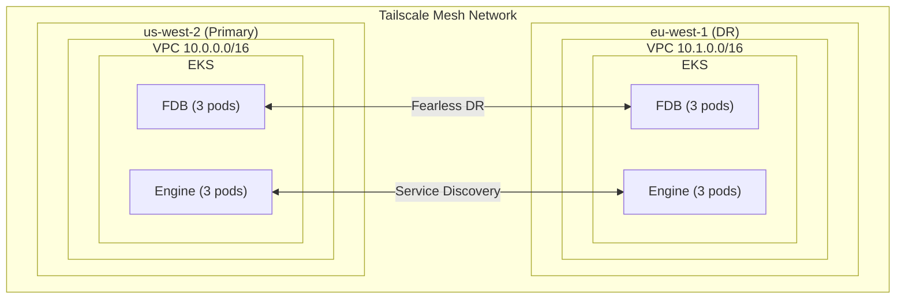

# InferaDB AWS Multi-Region Deployment

This example deploys InferaDB across two AWS regions with FoundationDB Fearless DR for automatic data replication and failover.

## Architecture



## Prerequisites

1. **AWS Account**: With permissions to create VPCs, EKS clusters, etc.
2. **Tailscale Account**: For cross-region networking
3. **Terraform**: Version 1.0 or later
4. **AWS CLI**: Configured with appropriate credentials
5. **kubectl**: For cluster management

## Quick Start

### 1. Clone and Configure

```bash
cd terraform/examples/aws-multi-region

# Copy example variables
cp terraform.tfvars.example terraform.tfvars

# Edit with your values
vim terraform.tfvars
```

### 2. Create Tailscale Keys

1. Go to <https://login.tailscale.com/admin/settings/keys>
2. Create an **API key** for ACL management
3. Create an **Auth key** (reusable, with tags `tag:fdb`, `tag:inferadb-engine`)
4. Add these to `terraform.tfvars`

### 3. Deploy

```bash
# Initialize Terraform
terraform init

# Review the plan
terraform plan

# Deploy (this will take 20-30 minutes)
terraform apply
```

### 4. Configure kubectl

```bash
# Primary cluster
aws eks update-kubeconfig --name inferadb-primary --region us-west-2

# DR cluster
aws eks update-kubeconfig --name inferadb-dr --region eu-west-1
```

### 5. Verify Deployment

```bash
# Check FDB cluster status in primary
kubectl exec -it inferadb-fdb-storage-0 -n inferadb -c foundationdb -- fdbcli --exec "status"

# Check Engine pods
kubectl get pods -n inferadb -l app.kubernetes.io/name=inferadb-engine

# Test Engine health
kubectl port-forward svc/inferadb-engine 8080:8080 -n inferadb
curl http://localhost:8080/readyz
```

## Configuration

### Region Sizing

| Workload | Recommended         | Notes              |
| -------- | ------------------- | ------------------ |
| Dev/Test | 1 node per role     | Single-region only |
| Small    | 3 nodes per role    | Minimum for HA     |
| Medium   | 5 nodes per role    | Better distribution|
| Large    | 9+ nodes per role   | High throughput    |

### Instance Types

| Component | Recommended                    | Notes                       |
| --------- | ------------------------------ | --------------------------- |
| FDB       | `i3.xlarge` or `i3en.xlarge`   | NVMe storage for performance|
| Engine    | `m6i.xlarge`                   | Compute-optimized           |
| Control   | `m6i.large`                    | Lower resource needs        |

### Cost Estimation

| Component         | Count | Instance   | Monthly Cost (approx) |
| ----------------- | ----- | ---------- | --------------------: |
| EKS Control Plane | 2     | -          |                  $146 |
| FDB Nodes         | 6     | i3.xlarge  |                $1,200 |
| General Nodes     | 6     | m6i.xlarge |                  $500 |
| NAT Gateways      | 6     | -          |                  $270 |
| **Total**         |       |            |       **~$2,100/month** |

*Note: Costs vary by region and usage patterns.*

## Failover Testing

### Simulate Primary Failure

```bash
# Scale down primary FDB cluster
kubectl scale statefulset inferadb-fdb-storage --replicas=0 -n inferadb --context eks-inferadb-primary

# Verify DR takes over (may take 30-60 seconds)
kubectl exec -it inferadb-fdb-storage-0 -n inferadb -c foundationdb --context eks-inferadb-dr -- fdbcli --exec "status"
```

### Restore Primary

```bash
# Scale up primary
kubectl scale statefulset inferadb-fdb-storage --replicas=3 -n inferadb --context eks-inferadb-primary

# Verify synchronization
kubectl exec -it inferadb-fdb-storage-0 -n inferadb -c foundationdb --context eks-inferadb-primary -- fdbcli --exec "status"
```

## Monitoring

### Prometheus Metrics

Enable ServiceMonitors by setting:

```hcl
create_service_monitors = true
```

Key metrics to monitor:

- `fdb_database_available`
- `fdb_replication_lag_seconds`
- `inferadb_requests_total`
- `inferadb_authorization_latency_seconds`

### CloudWatch

EKS automatically sends metrics to CloudWatch. Create dashboards for:

- Node CPU/Memory utilization
- Pod health and restarts
- Network throughput

## Security Considerations

1. **Network Isolation**: VPCs are isolated; traffic flows only through Tailscale
2. **Encryption**: All cross-region traffic is encrypted via WireGuard
3. **Access Control**: Tailscale ACLs restrict service-to-service communication
4. **Secrets**: Use AWS Secrets Manager or HashiCorp Vault for production

## Cleanup

```bash
# Destroy all resources
terraform destroy

# Remove Tailscale auth keys (manual step)
# Go to https://login.tailscale.com/admin/settings/keys
```

## Troubleshooting

### FDB Cluster Not Forming

1. Check operator logs:

   ```bash
   kubectl logs -n fdb-system deploy/fdb-operator
   ```

2. Verify Tailscale connectivity:

   ```bash
   kubectl exec -it inferadb-fdb-storage-0 -n inferadb -c tailscale -- tailscale status
   ```

### Replication Lag

1. Check FDB status:

   ```bash
   kubectl exec -it inferadb-fdb-storage-0 -n inferadb -c foundationdb -- fdbcli --exec "status details"
   ```

2. Verify cross-region network latency

### Engine Connection Failures

1. Check Engine logs:

   ```bash
   kubectl logs -n inferadb deploy/inferadb-engine
   ```

2. Verify FDB cluster file is mounted:

   ```bash
   kubectl exec -it deploy/inferadb-engine -n inferadb -- cat /etc/foundationdb/fdb.cluster
   ```

## Support

- [InferaDB Documentation](https://docs.inferadb.io)
- [FoundationDB Documentation](https://apple.github.io/foundationdb/)
- [Tailscale Documentation](https://tailscale.com/kb)
