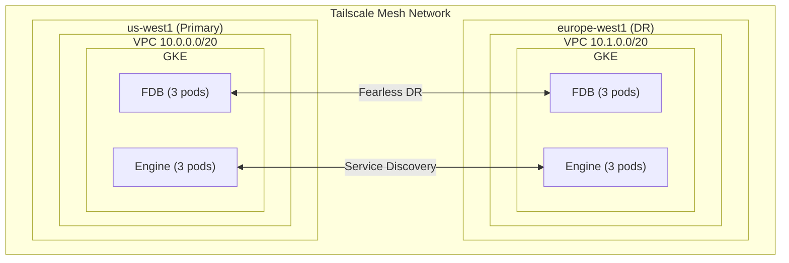

# InferaDB GCP Multi-Region Deployment

This example deploys InferaDB across two GCP regions with FoundationDB Fearless DR for automatic data replication and failover.

## Architecture



## Prerequisites

1. **GCP Account**: With permissions to create VPCs, GKE clusters, etc.
2. **Tailscale Account**: For cross-region networking
3. **Terraform**: Version 1.0 or later
4. **gcloud CLI**: Configured with appropriate credentials
5. **kubectl**: For cluster management

## Quick Start

### 1. Clone and Configure

```bash
cd terraform/examples/gcp-multi-region

# Copy example variables
cp terraform.tfvars.example terraform.tfvars

# Edit with your values
vim terraform.tfvars
```

### 2. Create Tailscale Keys

1. Go to <https://login.tailscale.com/admin/settings/keys>
2. Create an **API key** for ACL management
3. Create an **Auth key** (reusable, with tags `tag:fdb`, `tag:inferadb-engine`)
4. Add these to `terraform.tfvars`

### 3. Authenticate with GCP

```bash
gcloud auth application-default login
gcloud config set project YOUR_PROJECT_ID
```

### 4. Deploy

```bash
# Initialize Terraform
terraform init

# Review the plan
terraform plan

# Deploy (this will take 15-25 minutes)
terraform apply
```

### 5. Configure kubectl

```bash
# Primary cluster
gcloud container clusters get-credentials inferadb-primary --region us-west1

# DR cluster
gcloud container clusters get-credentials inferadb-dr --region europe-west1
```

### 6. Verify Deployment

```bash
# Check FDB cluster status in primary
kubectl exec -it inferadb-fdb-storage-0 -n inferadb -c foundationdb -- fdbcli --exec "status"

# Check Engine pods
kubectl get pods -n inferadb -l app.kubernetes.io/name=inferadb-engine

# Test Engine health
kubectl port-forward svc/inferadb-engine 8080:8080 -n inferadb
curl http://localhost:8080/readyz
```

## Configuration

### Region Sizing

| Workload | Recommended       | Notes              |
| -------- | ----------------- | ------------------ |
| Dev/Test | 1 node per role   | Single-region only |
| Small    | 3 nodes per role  | Minimum for HA     |
| Medium   | 5 nodes per role  | Better distribution|
| Large    | 9+ nodes per role | High throughput    |

### Machine Types

| Component | Recommended      | Notes                           |
| --------- | ---------------- | ------------------------------- |
| FDB       | `n2-standard-4`  | With local SSD for performance  |
| Engine    | `e2-standard-4`  | Compute-optimized               |
| Control   | `e2-standard-2`  | Lower resource needs            |

### Cost Estimation

| Component      | Count | Machine Type   | Monthly Cost (approx) |
| -------------- | ----- | -------------- | --------------------: |
| GKE Management | 2     | -              |                  $146 |
| FDB Nodes      | 6     | n2-standard-4  |                  $720 |
| General Nodes  | 6     | e2-standard-4  |                  $480 |
| NAT            | 6     | -              |                  $200 |
| **Total**      |       |                |    **~$1,550/month**  |

*Note: Costs vary by region and usage patterns.*

## Failover Testing

### Simulate Primary Failure

```bash
# Scale down primary FDB cluster
kubectl scale statefulset inferadb-fdb-storage --replicas=0 -n inferadb --context gke_PROJECT_primary

# Verify DR takes over (may take 30-60 seconds)
kubectl exec -it inferadb-fdb-storage-0 -n inferadb -c foundationdb --context gke_PROJECT_dr -- fdbcli --exec "status"
```

### Restore Primary

```bash
# Scale up primary
kubectl scale statefulset inferadb-fdb-storage --replicas=3 -n inferadb --context gke_PROJECT_primary

# Verify synchronization
kubectl exec -it inferadb-fdb-storage-0 -n inferadb -c foundationdb --context gke_PROJECT_primary -- fdbcli --exec "status"
```

## Monitoring

### Enable Cloud Monitoring

GKE automatically integrates with Cloud Monitoring. Create dashboards for:

- Node CPU/Memory utilization
- Pod health and restarts
- Network throughput

### Prometheus Metrics

Enable ServiceMonitors by setting:

```hcl
create_service_monitors = true
```

Key metrics to monitor:

- `fdb_database_available`
- `fdb_replication_lag_seconds`
- `inferadb_requests_total`
- `inferadb_authorization_latency_seconds`

## Security Considerations

1. **Network Isolation**: VPCs are isolated; traffic flows only through Tailscale
2. **Encryption**: All cross-region traffic is encrypted via WireGuard
3. **Access Control**: Tailscale ACLs restrict service-to-service communication
4. **Secrets**: Use Secret Manager for production secrets
5. **Workload Identity**: Enabled for secure GCP API access

## Cleanup

```bash
# Destroy all resources
terraform destroy

# Remove Tailscale auth keys (manual step)
# Go to https://login.tailscale.com/admin/settings/keys
```

## Troubleshooting

### GKE Cluster Not Ready

1. Check cluster status:

   ```bash
   gcloud container clusters list --project YOUR_PROJECT
   ```

2. Check node pool status:

   ```bash
   gcloud container node-pools list --cluster inferadb-primary --region us-west1
   ```

### FDB Cluster Not Forming

1. Check operator logs:

   ```bash
   kubectl logs -n fdb-system deploy/fdb-operator
   ```

2. Verify Tailscale connectivity:

   ```bash
   kubectl exec -it inferadb-fdb-storage-0 -n inferadb -c tailscale -- tailscale status
   ```

### Replication Lag

1. Check FDB status:

   ```bash
   kubectl exec -it inferadb-fdb-storage-0 -n inferadb -c foundationdb -- fdbcli --exec "status details"
   ```

2. Verify cross-region network latency

### Engine Connection Failures

1. Check Engine logs:

   ```bash
   kubectl logs -n inferadb deploy/inferadb-engine
   ```

2. Verify FDB cluster file is mounted:

   ```bash
   kubectl exec -it deploy/inferadb-engine -n inferadb -- cat /etc/foundationdb/fdb.cluster
   ```

## Support

- [InferaDB Documentation](https://docs.inferadb.io)
- [FoundationDB Documentation](https://apple.github.io/foundationdb/)
- [Tailscale Documentation](https://tailscale.com/kb)
- [GKE Documentation](https://cloud.google.com/kubernetes-engine/docs)
