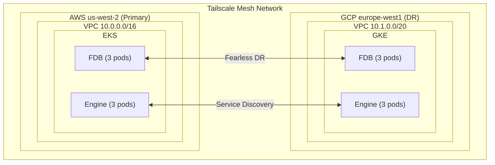

# InferaDB Multi-Cloud Deployment (AWS + GCP)

This example deploys InferaDB across AWS and GCP with FoundationDB Fearless DR for automatic data replication and failover.

## Why Multi-Cloud?

Multi-cloud deployments provide:

- **Vendor Independence**: No lock-in to a single cloud provider
- **Geographic Diversity**: True geographic redundancy across different infrastructure providers
- **Compliance**: Meet regulatory requirements for data sovereignty and disaster recovery
- **Cost Optimization**: Leverage best pricing from each provider

## Architecture



## Prerequisites

1. **AWS Account**: With permissions to create VPCs, EKS clusters, etc.
2. **GCP Account**: With permissions to create VPCs, GKE clusters, etc.
3. **Tailscale Account**: For cross-cloud networking
4. **Terraform**: Version 1.0 or later
5. **AWS CLI**: Configured with appropriate credentials
6. **gcloud CLI**: Configured with appropriate credentials
7. **kubectl**: For cluster management

## Quick Start

### 1. Clone and Configure

```bash
cd terraform/examples/multi-cloud

# Copy example variables
cp terraform.tfvars.example terraform.tfvars

# Edit with your values
vim terraform.tfvars
```

### 2. Create Tailscale Keys

1. Go to <https://login.tailscale.com/admin/settings/keys>
2. Create an **API key** for ACL management
3. Create an **Auth key** (reusable, with tags `tag:fdb`, `tag:inferadb-engine`)
4. Add these to `terraform.tfvars`

### 3. Authenticate with Cloud Providers

```bash
# AWS
aws configure
# or use AWS SSO
aws sso login

# GCP
gcloud auth application-default login
gcloud config set project YOUR_PROJECT_ID
```

### 4. Deploy

```bash
# Initialize Terraform
terraform init

# Review the plan
terraform plan

# Deploy (this will take 25-35 minutes)
terraform apply
```

### 5. Configure kubectl

```bash
# AWS cluster
aws eks update-kubeconfig --name inferadb-aws --region us-west-2

# GCP cluster
gcloud container clusters get-credentials inferadb-gcp --region europe-west1 --project YOUR_PROJECT
```

### 6. Verify Deployment

```bash
# Check FDB cluster status in AWS
kubectl exec -it inferadb-fdb-storage-0 -n inferadb -c foundationdb --context eks-inferadb-aws -- fdbcli --exec "status"

# Check Engine pods in both clusters
kubectl get pods -n inferadb -l app.kubernetes.io/name=inferadb-engine --context eks-inferadb-aws
kubectl get pods -n inferadb -l app.kubernetes.io/name=inferadb-engine --context gke_PROJECT_europe-west1_inferadb-gcp

# Test Engine health
kubectl port-forward svc/inferadb-engine 8080:8080 -n inferadb --context eks-inferadb-aws
curl http://localhost:8080/readyz
```

## Configuration

### Instance Type Mapping

| Workload | AWS           | GCP              | Notes                        |
| -------- | ------------- | ---------------- | ---------------------------- |
| FDB      | `i3.xlarge`   | `n2-standard-4`  | NVMe/local SSD for performance|
| Engine   | `m6i.xlarge`  | `e2-standard-4`  | Compute-optimized            |
| Control  | `m6i.large`   | `e2-standard-2`  | Lower resource needs         |

### Cost Estimation

| Component                          | AWS (us-west-2) | GCP (europe-west1) | Monthly Total |
| ---------------------------------- | --------------: | -----------------: | ------------: |
| Kubernetes Control Plane           |             $73 |                $73 |          $146 |
| FDB Nodes (3x i3.xlarge / n2-std-4)|            $600 |               $360 |          $960 |
| General Nodes (3x m6i.xlarge / e2) |            $250 |               $240 |          $490 |
| NAT                                |            $135 |               $100 |          $235 |
| **Total**                          |      **$1,058** |           **$773** | **~$1,830/month** |

*Note: Costs are estimates and vary by region, usage patterns, and reserved instances.*

## Network Architecture

### Tailscale Mesh

Tailscale provides secure cross-cloud connectivity:

- **WireGuard-based**: Fast, modern encryption
- **NAT traversal**: Works across any network topology
- **No public IPs needed**: Pods communicate via private Tailscale IPs

### CIDR Allocation

| Cloud | CIDR         | Purpose  |
| ----- | ------------ | -------- |
| AWS   | 10.0.0.0/16  | VPC      |
| GCP   | 10.1.0.0/20  | Nodes    |
| GCP   | 10.1.16.0/20 | Pods     |
| GCP   | 10.1.32.0/20 | Services |

## Failover Testing

### Simulate AWS Primary Failure

```bash
# Scale down AWS FDB cluster
kubectl scale statefulset inferadb-fdb-storage --replicas=0 -n inferadb --context eks-inferadb-aws

# Verify GCP DR takes over (may take 30-60 seconds)
kubectl exec -it inferadb-fdb-storage-0 -n inferadb -c foundationdb --context gke_PROJECT_europe-west1_inferadb-gcp -- fdbcli --exec "status"
```

### Restore AWS Primary

```bash
# Scale up AWS
kubectl scale statefulset inferadb-fdb-storage --replicas=3 -n inferadb --context eks-inferadb-aws

# Verify synchronization
kubectl exec -it inferadb-fdb-storage-0 -n inferadb -c foundationdb --context eks-inferadb-aws -- fdbcli --exec "status"
```

## Security Considerations

1. **Network Isolation**: Each cloud has its own VPC; traffic flows only through Tailscale
2. **Encryption**: All cross-cloud traffic is encrypted via WireGuard
3. **Access Control**: Tailscale ACLs restrict service-to-service communication
4. **Secrets Management**:
   - AWS: Use AWS Secrets Manager or Parameter Store
   - GCP: Use Secret Manager
5. **Identity**: Use cloud-native identity (IAM roles, Workload Identity)

## Monitoring

### AWS CloudWatch

EKS integrates with CloudWatch. Enable Container Insights for:

- Node and pod metrics
- Container logs
- Application traces

### GCP Cloud Monitoring

GKE integrates with Cloud Monitoring. Enable for:

- Node and pod metrics
- Container logs
- Application traces

### Prometheus

For unified monitoring across clouds:

```hcl
create_service_monitors = true
```

Then deploy Prometheus/Thanos with cross-cloud federation.

## Cleanup

```bash
# Destroy all resources
terraform destroy

# Remove Tailscale auth keys (manual step)
# Go to https://login.tailscale.com/admin/settings/keys
```

## Troubleshooting

### Cross-Cloud Connectivity Issues

1. Check Tailscale status on both sides:

   ```bash
   # AWS
   kubectl exec -it inferadb-fdb-storage-0 -n inferadb -c tailscale --context eks-inferadb-aws -- tailscale status

   # GCP
   kubectl exec -it inferadb-fdb-storage-0 -n inferadb -c tailscale --context gke_PROJECT_europe-west1_inferadb-gcp -- tailscale status
   ```

2. Verify ACLs are applied:

   ```bash
   tailscale debug acl
   ```

### FDB Replication Not Working

1. Check FDB status in both clusters:

   ```bash
   kubectl exec -it inferadb-fdb-storage-0 -n inferadb -c foundationdb -- fdbcli --exec "status details"
   ```

2. Verify multi-region configuration matches

### High Cross-Cloud Latency

1. Check network latency:

   ```bash
   kubectl exec -it inferadb-fdb-storage-0 -n inferadb -c tailscale -- tailscale ping <other-node>
   ```

2. Consider adjusting FDB configuration:
   - Increase `satellite_logs` for better replication bandwidth
   - Use `async` replication if strong consistency isn't required

## Support

- [InferaDB Documentation](https://docs.inferadb.io)
- [FoundationDB Documentation](https://apple.github.io/foundationdb/)
- [Tailscale Documentation](https://tailscale.com/kb)
- [AWS EKS Documentation](https://docs.aws.amazon.com/eks/)
- [GCP GKE Documentation](https://cloud.google.com/kubernetes-engine/docs)
