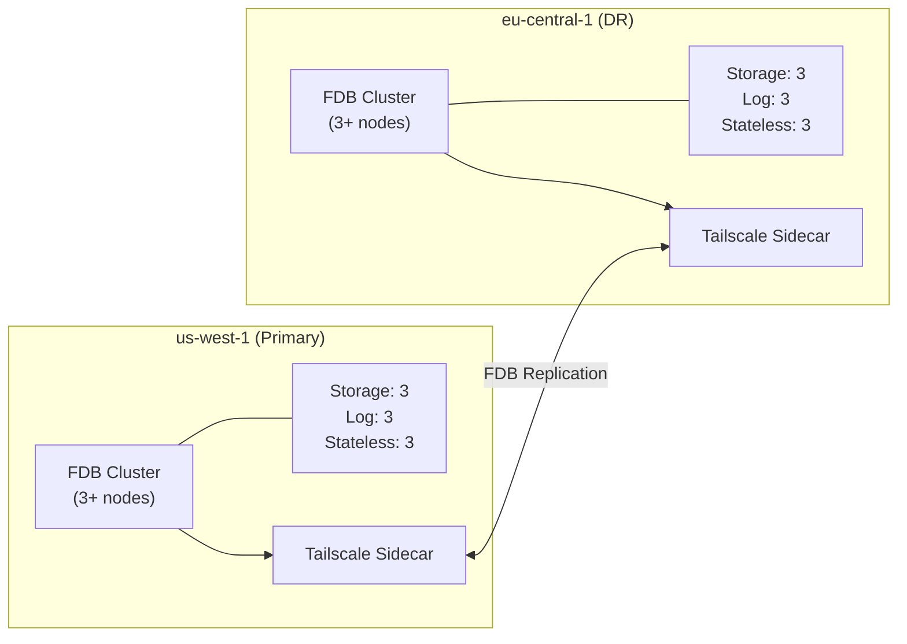

# FDB Cluster Module

Terraform module to deploy a FoundationDB cluster using the FDB Kubernetes Operator.

## Overview

This module creates a `FoundationDBCluster` custom resource that the FDB Kubernetes Operator reconciles into a running FoundationDB cluster. It supports:

- Single-region and multi-region (Fearless DR) deployments
- Configurable redundancy modes and storage engines
- Tailscale sidecar for cross-region networking
- Automatic backup configuration
- Prometheus metrics integration

## Prerequisites

- FDB Kubernetes Operator must be installed (use `fdb-operator` module)
- Kubernetes cluster with sufficient resources
- Storage class capable of provisioning persistent volumes

## Usage

### Basic Single-Region Cluster

```hcl
module "fdb_cluster" {
  source = "./modules/fdb-cluster"

  cluster_name = "inferadb-fdb"
  namespace    = "inferadb"
  fdb_version  = "7.3.43"

  process_counts = {
    storage   = 3
    log       = 3
    stateless = 3
  }

  redundancy_mode = "double"
  storage_engine  = "ssd-2"
  volume_size     = "128Gi"
}
```

### Multi-Region Primary Cluster

```hcl
module "fdb_cluster_primary" {
  source = "./modules/fdb-cluster"

  cluster_name = "inferadb-fdb"
  namespace    = "inferadb"
  fdb_version  = "7.3.43"

  # Region identification
  region_id    = "us-west-1"
  datacenter_id = "us-west-1a"
  is_primary   = true
  priority     = 1

  # Enable Tailscale for cross-region networking
  tailscale = {
    enabled = true
    secret_ref = {
      name = "tailscale-auth"
      key  = "authkey"
    }
    hostname = "fdb-us-west-1"
  }

  # Multi-region configuration
  multi_region_config = {
    enabled        = true
    usable_regions = 1  # Primary + DR
    satellite_logs = 4
    regions = [
      {
        id       = "us-west-1"
        priority = 1
        satellite = false
      },
      {
        id       = "eu-central-1"
        priority = 2
        satellite = false
      }
    ]
  }
}
```

### Multi-Region Secondary Cluster

```hcl
module "fdb_cluster_secondary" {
  source = "./modules/fdb-cluster"

  cluster_name = "inferadb-fdb"
  namespace    = "inferadb"
  fdb_version  = "7.3.43"

  # Region identification
  region_id     = "eu-central-1"
  datacenter_id = "eu-central-1a"
  is_primary    = false
  priority      = 2

  # Enable Tailscale for cross-region networking
  tailscale = {
    enabled = true
    secret_ref = {
      name = "tailscale-auth"
      key  = "authkey"
    }
    hostname = "fdb-eu-central-1"
  }

  # Multi-region configuration (must match primary)
  multi_region_config = {
    enabled        = true
    usable_regions = 1
    satellite_logs = 4
    regions = [
      {
        id       = "us-west-1"
        priority = 1
        satellite = false
      },
      {
        id       = "eu-central-1"
        priority = 2
        satellite = false
      }
    ]
  }
}
```

### With Backup Enabled

```hcl
module "fdb_cluster" {
  source = "./modules/fdb-cluster"

  cluster_name = "inferadb-fdb"
  namespace    = "inferadb"
  fdb_version  = "7.3.43"

  # Enable backup
  backup_enabled            = true
  backup_bucket             = "s3://my-backup-bucket/fdb"
  backup_credentials_secret = "aws-backup-credentials"
}
```

## Connecting Applications

After deploying the FDB cluster, applications can connect using the cluster file. The module outputs volume mount specifications that can be used in application deployments:

```hcl
# In your application module
resource "kubernetes_deployment" "app" {
  # ...
  spec {
    template {
      spec {
        container {
          # ...
          volume_mount {
            name       = module.fdb_cluster.volume_mount_spec.volumeMount.name
            mount_path = module.fdb_cluster.volume_mount_spec.volumeMount.mountPath
            read_only  = module.fdb_cluster.volume_mount_spec.volumeMount.readOnly
          }

          env {
            name  = module.fdb_cluster.env_var_spec.name
            value = module.fdb_cluster.env_var_spec.value
          }
        }

        volume {
          name = module.fdb_cluster.volume_mount_spec.volume.name
          config_map {
            name = module.fdb_cluster.volume_mount_spec.volume.configMap.name
          }
        }
      }
    }
  }
}
```

## Requirements

| Name       | Version |
| ---------- | ------- |
| terraform  | >= 1.0  |
| kubernetes | >= 2.20 |

## Inputs

| Name                | Description                         | Type     | Default            | Required |
| ------------------- | ----------------------------------- | -------- | ------------------ | :------: |
| cluster_name        | Name of the FDB cluster             | `string` | n/a                |   yes    |
| namespace           | Kubernetes namespace                | `string` | n/a                |   yes    |
| fdb_version         | FoundationDB version                | `string` | `"7.3.43"`         |    no    |
| process_counts      | Number of processes per role        | `object` | See variables.tf   |    no    |
| redundancy_mode     | Redundancy mode                     | `string` | `"double"`         |    no    |
| storage_engine      | Storage engine                      | `string` | `"ssd-2"`          |    no    |
| volume_size         | Size of persistent volumes          | `string` | `"128Gi"`          |    no    |
| region_id           | Region identifier                   | `string` | `""`               |    no    |
| datacenter_id       | Datacenter identifier               | `string` | `""`               |    no    |
| is_primary          | Whether this is the primary region  | `bool`   | `true`             |    no    |
| priority            | Region priority                     | `number` | `1`                |    no    |
| multi_region_config | Multi-region Fearless DR config     | `object` | `{enabled=false}`  |    no    |
| tailscale           | Tailscale sidecar configuration     | `object` | `{enabled=false}`  |    no    |
| resources           | Resource requests/limits            | `object` | See variables.tf   |    no    |

## Outputs

| Name                        | Description                             |
| --------------------------- | --------------------------------------- |
| cluster_name                | Name of the FDB cluster                 |
| namespace                   | Deployment namespace                    |
| cluster_file_secret_name    | Secret containing cluster file          |
| cluster_file_configmap_name | ConfigMap containing cluster file       |
| connection_string_path      | Path for cluster file mount             |
| region_id                   | Region identifier                       |
| is_primary                  | Whether this is primary                 |
| volume_mount_spec           | Volume mount specification for apps     |
| env_var_spec                | Environment variable specification      |

## Redundancy Modes

| Mode               | Description  | Min Nodes | Fault Tolerance |
| ------------------ | ------------ | --------- | --------------- |
| `single`           | Single copy  | 1         | None            |
| `double`           | Two copies   | 3         | 1 machine       |
| `triple`           | Three copies | 5         | 2 machines      |
| `three_datacenter` | Three DCs    | 3 DCs     | 1 DC            |
| `three_data_hall`  | Three halls  | 3 halls   | 1 hall          |

## Multi-Region Architecture

For Fearless DR deployments, the module configures FDB's native multi-region replication:



## Related Modules

- `fdb-operator` - Deploy the FDB Kubernetes Operator
- `multi-region` - Orchestrate multi-region deployments
- `tailscale-acls` - Configure cross-region networking ACLs

## References

- [FDB Kubernetes Operator](https://github.com/FoundationDB/fdb-kubernetes-operator)
- [FoundationDB Configuration](https://apple.github.io/foundationdb/configuration.html)
- [Fearless DR Documentation](https://apple.github.io/foundationdb/configuration.html#fearless-dr)
