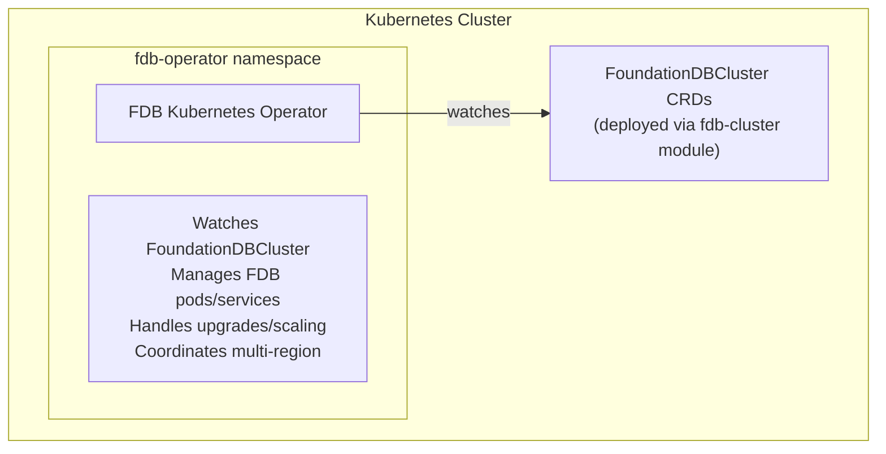
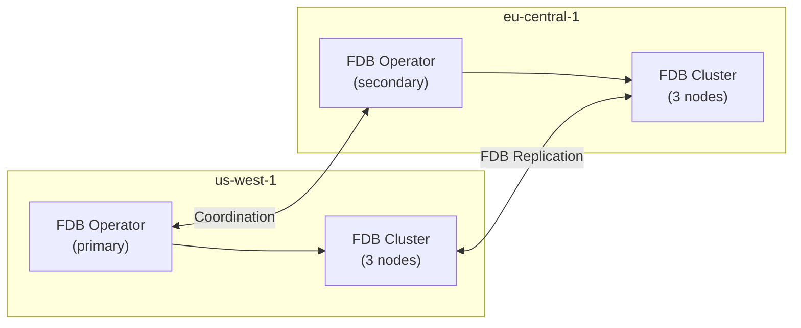

# FDB Kubernetes Operator Module

Terraform module to deploy the [FoundationDB Kubernetes Operator](https://github.com/FoundationDB/fdb-kubernetes-operator) via Helm.

## Overview

The FDB Kubernetes Operator automates the management of FoundationDB clusters in Kubernetes, including:

- Cluster deployment and configuration
- Scaling (up/down)
- Rolling upgrades
- Automatic failover and recovery
- Multi-region coordination (Fearless DR)

## Usage

### Basic Deployment

```hcl
module "fdb_operator" {
  source = "./modules/fdb-operator"

  namespace        = "fdb-system"
  operator_version = "1.45.0"
}
```

### Multi-Cluster Mode (for Multi-Region)

For multi-region deployments with Fearless DR, enable multi-cluster mode:

```hcl
module "fdb_operator" {
  source = "./modules/fdb-operator"

  namespace          = "fdb-system"
  operator_version   = "1.45.0"
  multi_cluster_mode = true
  cluster_label      = "us-west-1"

  # Enable Prometheus metrics
  enable_metrics         = true
  create_service_monitor = true
}
```

### With Custom Resources

```hcl
module "fdb_operator" {
  source = "./modules/fdb-operator"

  namespace        = "fdb-system"
  operator_version = "1.45.0"

  resources = {
    requests = {
      cpu    = "200m"
      memory = "512Mi"
    }
    limits = {
      cpu    = "1000m"
      memory = "1Gi"
    }
  }

  node_selector = {
    "node-role.kubernetes.io/infra" = "true"
  }

  tolerations = [
    {
      key      = "node-role.kubernetes.io/infra"
      operator = "Exists"
      effect   = "NoSchedule"
    }
  ]
}
```

## Requirements

| Name       | Version |
| ---------- | ------- |
| terraform  | >= 1.0  |
| kubernetes | >= 2.20 |
| helm       | >= 2.10 |

## Providers

| Name       | Version |
| ---------- | ------- |
| kubernetes | >= 2.20 |
| helm       | >= 2.10 |

## Inputs

| Name                   | Description                                    | Type     | Default          | Required |
| ---------------------- | ---------------------------------------------- | -------- | ---------------- | :------: |
| namespace              | Kubernetes namespace for the operator          | `string` | `"fdb-operator"` |    no    |
| create_namespace       | Create namespace if it doesn't exist           | `bool`   | `true`           |    no    |
| operator_version       | FDB Operator version                           | `string` | `"1.45.0"`       |    no    |
| fdb_version            | Default FoundationDB version                   | `string` | `"7.3.43"`       |    no    |
| replicas               | Number of operator replicas                    | `number` | `1`              |    no    |
| multi_cluster_mode     | Enable multi-cluster coordination              | `bool`   | `false`          |    no    |
| cluster_label          | Cluster identifier for multi-cluster mode      | `string` | `""`             |    no    |
| enable_metrics         | Enable Prometheus metrics                      | `bool`   | `true`           |    no    |
| create_service_monitor | Create ServiceMonitor for Prometheus Operator  | `bool`   | `false`          |    no    |
| resources              | Resource requests/limits                       | `object` | See variables.tf |    no    |
| node_selector          | Node selector for operator pods                | `map(string)` | `{}`        |    no    |
| tolerations            | Tolerations for operator pods                  | `list(object)` | `[]`       |    no    |

## Outputs

| Name               | Description                       |
| ------------------ | --------------------------------- |
| namespace          | Namespace where operator is deployed |
| release_name       | Helm release name                 |
| release_version    | Installed operator version        |
| release_status     | Helm release status               |
| operator_ready     | Whether operator is ready         |
| multi_cluster_mode | Multi-cluster mode status         |
| cluster_label      | Cluster label for multi-cluster   |

## Architecture



## Multi-Region Architecture

When `multi_cluster_mode` is enabled, the operator coordinates with operators in other Kubernetes clusters to manage cross-region FoundationDB deployments:



## Next Steps

After deploying the operator, use the `fdb-cluster` module to create FoundationDB clusters:

```hcl
module "fdb_cluster" {
  source = "./modules/fdb-cluster"

  cluster_name = "inferadb-fdb"
  namespace    = "inferadb"
  fdb_version  = module.fdb_operator.fdb_version

  # Multi-region configuration
  region_id    = "us-west-1"
  is_primary   = true
}
```

## Related Modules

- `fdb-cluster` - Deploy FoundationDB clusters
- `multi-region` - Orchestrate multi-region deployments
- `tailscale-acls` - Configure cross-region networking

## References

- [FDB Kubernetes Operator Documentation](https://github.com/FoundationDB/fdb-kubernetes-operator/tree/main/docs)
- [FoundationDB Documentation](https://apple.github.io/foundationdb/)
- [Fearless DR Guide](https://apple.github.io/foundationdb/configuration.html#fearless-dr)
