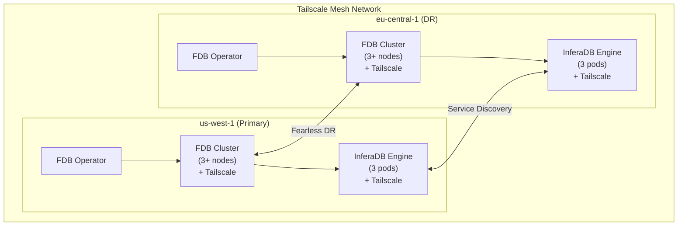
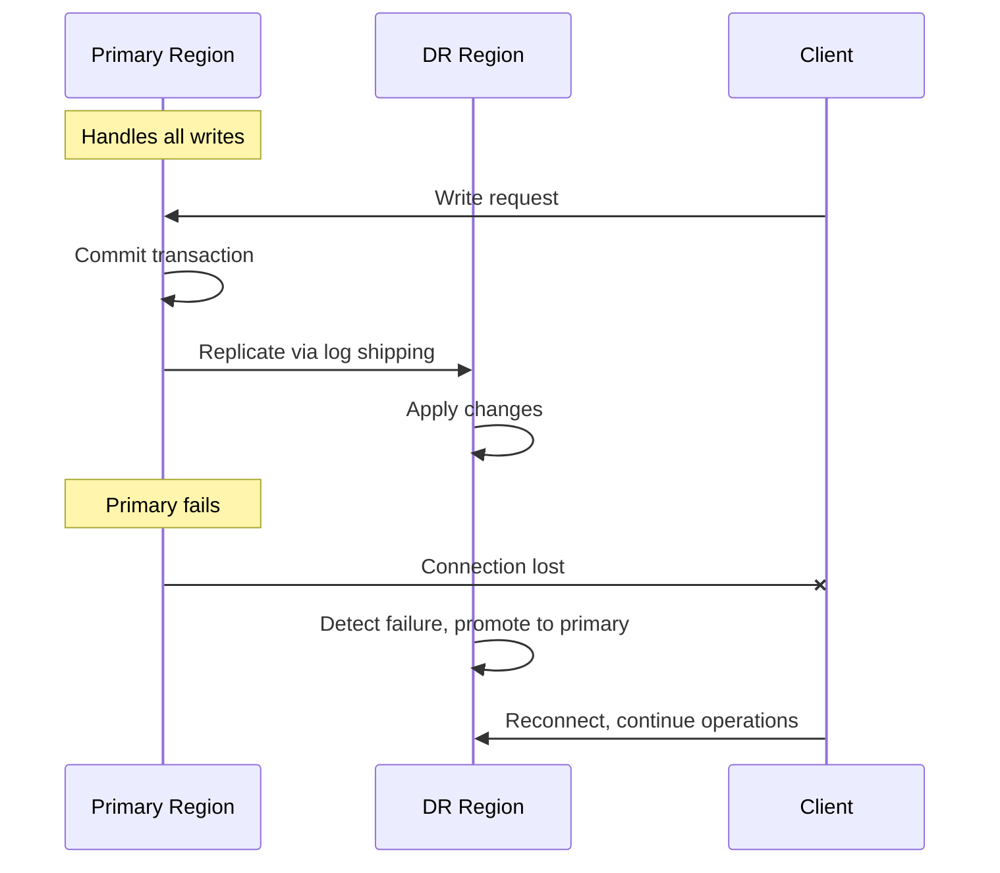
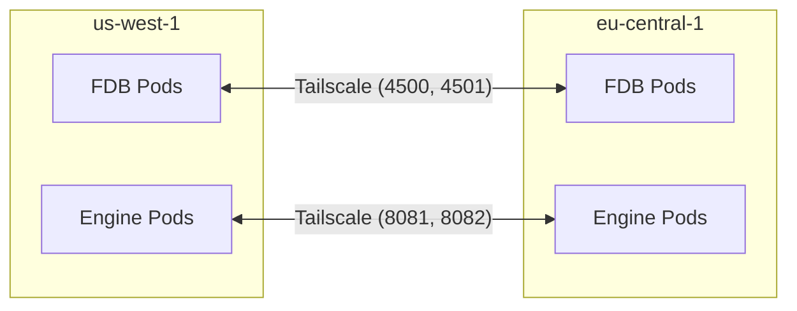

# Multi-Region Orchestration Module

Terraform module to deploy InferaDB across multiple regions with FoundationDB Fearless DR replication.

## Overview

This module orchestrates the complete multi-region deployment of InferaDB, including:

- FDB Kubernetes Operator deployment in each region
- FoundationDB clusters with Fearless DR configuration
- InferaDB Engine deployments connected to regional FDB clusters
- Cross-region networking via Tailscale
- Consistent configuration across all regions

## Architecture



## Usage

### Basic Two-Region Deployment

```hcl
module "inferadb" {
  source = "./modules/multi-region"

  regions = [
    {
      id         = "us-west-1"
      name       = "US West"
      is_primary = true
      priority   = 1
      namespace  = "inferadb"

      kubernetes = {
        config_context = "aws-us-west-1"
      }

      process_counts = {
        storage   = 3
        log       = 3
        stateless = 3
      }
    },
    {
      id         = "eu-central-1"
      name       = "EU Central"
      is_primary = false
      priority   = 2
      namespace  = "inferadb"

      kubernetes = {
        config_context = "aws-eu-central-1"
      }

      process_counts = {
        storage   = 3
        log       = 3
        stateless = 3
      }
    }
  ]

  cluster_name    = "inferadb-fdb"
  fdb_version     = "7.3.43"
  redundancy_mode = "double"

  fearless_dr = {
    enabled        = true
    usable_regions = 1
    satellite_logs = 4
  }

  tailscale = {
    enabled     = true
    auth_key    = var.tailscale_auth_key
    secret_name = "tailscale-auth"
  }

  engine = {
    enabled  = true
    replicas = 3
    image    = "inferadb-engine:v1.0.0"
  }
}
```

### Three-Region Deployment

```hcl
module "inferadb" {
  source = "./modules/multi-region"

  regions = [
    {
      id         = "us-west-1"
      name       = "US West (Primary)"
      is_primary = true
      priority   = 1
      namespace  = "inferadb"
      zones      = ["us-west-1a", "us-west-1b", "us-west-1c"]

      kubernetes = {
        config_context = "eks-us-west-1"
      }
    },
    {
      id         = "eu-central-1"
      name       = "EU Central (DR)"
      is_primary = false
      priority   = 2
      namespace  = "inferadb"
      zones      = ["eu-central-1a", "eu-central-1b", "eu-central-1c"]

      kubernetes = {
        config_context = "eks-eu-central-1"
      }
    },
    {
      id         = "ap-southeast-1"
      name       = "Asia Pacific (DR)"
      is_primary = false
      priority   = 3
      namespace  = "inferadb"
      zones      = ["ap-southeast-1a", "ap-southeast-1b", "ap-southeast-1c"]

      kubernetes = {
        config_context = "eks-ap-southeast-1"
      }
    }
  ]

  cluster_name = "inferadb-fdb"

  fearless_dr = {
    enabled        = true
    usable_regions = 2  # Requires 2 regions to be available
    satellite_logs = 6
  }

  tailscale = {
    enabled     = true
    auth_key    = var.tailscale_auth_key
  }
}
```

### With Custom Resource Sizing

```hcl
module "inferadb" {
  source = "./modules/multi-region"

  regions = [
    {
      id         = "us-west-1"
      name       = "US West"
      is_primary = true
      priority   = 1
      namespace  = "inferadb"

      kubernetes = {
        config_context = "production-us-west"
      }

      # Custom FDB sizing for this region
      process_counts = {
        storage   = 5
        log       = 5
        stateless = 5
      }

      resources = {
        requests = {
          cpu    = "2"
          memory = "8Gi"
        }
        limits = {
          cpu    = "4"
          memory = "16Gi"
        }
      }

      # Use specific storage class
      storage_class = "fast-ssd"

      # Node selection
      node_selector = {
        "node-role.kubernetes.io/fdb" = "true"
      }

      tolerations = [
        {
          key      = "dedicated"
          operator = "Equal"
          value    = "fdb"
          effect   = "NoSchedule"
        }
      ]
    },
    # ... other regions
  ]

  engine = {
    enabled  = true
    replicas = 5
    image    = "inferadb-engine:v1.0.0"
    resources = {
      requests = {
        cpu    = "1"
        memory = "1Gi"
      }
      limits = {
        cpu    = "4"
        memory = "4Gi"
      }
    }
  }
}
```

## Requirements

| Name       | Version |
| ---------- | ------- |
| terraform  | >= 1.0  |
| kubernetes | >= 2.20 |
| helm       | >= 2.10 |

## Providers

The module requires access to Kubernetes clusters in all specified regions. Configure providers in the root module:

```hcl
provider "kubernetes" {
  alias          = "us-west-1"
  config_path    = "~/.kube/config"
  config_context = "eks-us-west-1"
}

provider "kubernetes" {
  alias          = "eu-central-1"
  config_path    = "~/.kube/config"
  config_context = "eks-eu-central-1"
}

provider "helm" {
  alias = "us-west-1"
  kubernetes {
    config_path    = "~/.kube/config"
    config_context = "eks-us-west-1"
  }
}

provider "helm" {
  alias = "eu-central-1"
  kubernetes {
    config_path    = "~/.kube/config"
    config_context = "eks-eu-central-1"
  }
}
```

## Inputs

| Name             | Description                     | Type           | Default           | Required |
| ---------------- | ------------------------------- | -------------- | ----------------- | :------: |
| regions          | List of regions to deploy       | `list(object)` | n/a               |   yes    |
| cluster_name     | Base name for FDB cluster       | `string`       | `"inferadb-fdb"`  |    no    |
| fdb_version      | FoundationDB version            | `string`       | `"7.3.43"`        |    no    |
| operator_version | FDB Operator version            | `string`       | `"1.45.0"`        |    no    |
| redundancy_mode  | FDB redundancy mode             | `string`       | `"double"`        |    no    |
| fearless_dr      | Fearless DR configuration       | `object`       | `{enabled=true}`  |    no    |
| tailscale        | Tailscale networking config     | `object`       | `{enabled=true}`  |    no    |
| engine           | InferaDB Engine config          | `object`       | `{enabled=true}`  |    no    |
| control          | InferaDB Control config         | `object`       | `{enabled=true}`  |    no    |
| monitoring       | Monitoring configuration        | `object`       | `{enabled=true}`  |    no    |

## Outputs

| Name                    | Description                         |
| ----------------------- | ----------------------------------- |
| regions                 | Deployed regions configuration      |
| primary_region          | Primary region details              |
| fdb_operators           | FDB Operator status per region      |
| fdb_clusters            | FDB cluster details per region      |
| engine_endpoints        | Engine service endpoints per region |
| fearless_dr_config      | Fearless DR configuration           |
| cluster_connection_info | Connection info for applications    |

## Fearless DR Configuration

The module configures FoundationDB's Fearless DR for automatic cross-region replication:

### How It Works



1. **Primary Region**: Handles all write operations
2. **DR Regions**: Maintain synchronized copies of data via FDB's log shipping
3. **Automatic Failover**: If primary fails, a DR region is promoted automatically
4. **Recovery**: When primary returns, it re-syncs and can be promoted back

### Configuration Options

| Parameter        | Description                             | Default |
| ---------------- | --------------------------------------- | ------- |
| `usable_regions` | Number of regions that must be available | 1       |
| `satellite_logs` | Number of log processes for replication  | 4       |

### Failover Priority

Regions are prioritized by their `priority` value (lower = higher priority). In a failover:

1. The highest-priority available region becomes the new primary
2. Other regions continue replicating from the new primary
3. Applications can continue reading/writing with minimal disruption

## Cross-Region Networking

The module uses Tailscale for cross-region communication:



1. **FDB Nodes**: Each FDB pod has a Tailscale sidecar for direct peer communication
2. **Engine Pods**: Each Engine pod has a Tailscale sidecar for cross-region service discovery
3. **ACLs**: Tailscale ACLs restrict traffic to authorized services

### Tailscale Setup

1. Create a Tailscale auth key (reusable, tagged)
2. Pass the auth key to the module via `tailscale.auth_key`
3. The module creates secrets and configures sidecars automatically

## Related Modules

- `fdb-operator` - FDB Kubernetes Operator deployment
- `fdb-cluster` - Individual FDB cluster deployment
- `tailscale-acls` - Tailscale ACL configuration

## References

- [FoundationDB Fearless DR](https://apple.github.io/foundationdb/configuration.html#fearless-dr)
- [FDB Kubernetes Operator](https://github.com/FoundationDB/fdb-kubernetes-operator)
- [Tailscale Kubernetes](https://tailscale.com/kb/1185/kubernetes)
