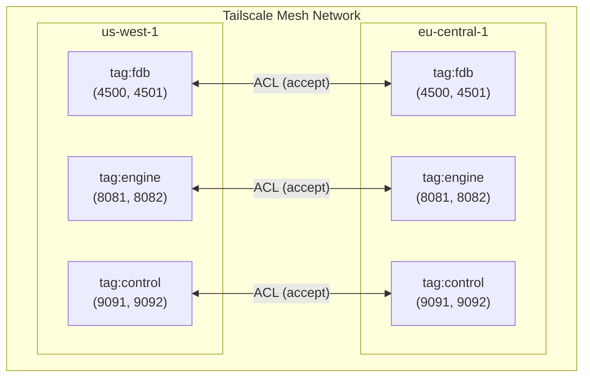

# Tailscale ACLs Module

Terraform module to manage Tailscale ACLs for InferaDB multi-region networking.

## Overview

This module creates Tailscale ACL policies that enable secure cross-region communication for:

- **FoundationDB nodes**: For Fearless DR replication across regions
- **InferaDB Engine pods**: For cross-region service discovery and replication
- **InferaDB Control pods**: For control plane communication

## Architecture



## Usage

### Basic Configuration

```hcl
module "tailscale_acls" {
  source = "./modules/tailscale-acls"

  tailnet = "your-org.ts.net"
  api_key = var.tailscale_api_key

  regions = [
    { id = "us-west-1", name = "US West" },
    { id = "eu-central-1", name = "EU Central" }
  ]
}
```

### With Custom Ports

```hcl
module "tailscale_acls" {
  source = "./modules/tailscale-acls"

  tailnet = "your-org.ts.net"
  api_key = var.tailscale_api_key

  ports = {
    fdb_port          = 4500
    fdb_tls_port      = 4501
    engine_http_port  = 8080
    engine_grpc_port  = 8081
    engine_mesh_port  = 8082
    control_http_port = 9091
    control_mesh_port = 9092
  }
}
```

### With SSH Access

```hcl
module "tailscale_acls" {
  source = "./modules/tailscale-acls"

  tailnet = "your-org.ts.net"
  api_key = var.tailscale_api_key

  enable_ssh = true
  ssh_allowed_users = [
    "autogroup:admin",
    "user@example.com"
  ]
}
```

### With Additional ACL Rules

```hcl
module "tailscale_acls" {
  source = "./modules/tailscale-acls"

  tailnet = "your-org.ts.net"
  api_key = var.tailscale_api_key

  additional_acls = [
    {
      action      = "accept"
      src         = ["tag:monitoring"]
      dst         = ["tag:inferadb-engine:8080"]
      description = "Allow monitoring to scrape Engine metrics"
    },
    {
      action      = "accept"
      src         = ["autogroup:member"]
      dst         = ["tag:inferadb-engine:8080"]
      description = "Allow team members to access Engine API"
    }
  ]
}
```

### With Tag Owners

```hcl
module "tailscale_acls" {
  source = "./modules/tailscale-acls"

  tailnet = "your-org.ts.net"
  api_key = var.tailscale_api_key

  tag_owners = {
    fdb_owners     = ["group:sre", "group:platform"]
    engine_owners  = ["group:sre", "group:backend"]
    control_owners = ["group:sre"]
  }
}
```

## Requirements

| Name      | Version |
| --------- | ------- |
| terraform | >= 1.0  |
| tailscale | >= 0.13 |

## Provider Configuration

```hcl
provider "tailscale" {
  api_key = var.tailscale_api_key
  tailnet = var.tailnet
}
```

## Inputs

| Name              | Description             | Type           | Default          | Required |
| ----------------- | ----------------------- | -------------- | ---------------- | :------: |
| tailnet           | Tailscale tailnet name  | `string`       | n/a              |   yes    |
| api_key           | Tailscale API key       | `string`       | n/a              |   yes    |
| tags              | Tag definitions         | `object`       | See variables.tf |    no    |
| tag_owners        | Tag ownership config    | `object`       | `{}`             |    no    |
| ports             | Port configuration      | `object`       | See variables.tf |    no    |
| regions           | List of regions         | `list(object)` | `[]`             |    no    |
| additional_acls   | Extra ACL rules         | `list(object)` | `[]`             |    no    |
| enable_ssh        | Enable SSH access       | `bool`         | `false`          |    no    |
| ssh_allowed_users | SSH allowed users       | `list(string)` | `[]`             |    no    |
| dns               | DNS configuration       | `object`       | See variables.tf |    no    |

## Outputs

| Name            | Description           |
| --------------- | --------------------- |
| acl_policy      | Generated ACL policy document |
| acl_policy_json | ACL policy as JSON    |
| tags            | Tag definitions used  |
| ports           | Port configuration    |
| acl_rules_count | Number of ACL rules   |

## Default ACL Rules

The module creates the following default ACL rules:

| Source               | Destination            | Ports       | Purpose             |
| -------------------- | ---------------------- | ----------- | ------------------- |
| `tag:fdb`            | `tag:fdb`              | 4500, 4501  | FDB cluster communication |
| `tag:inferadb-engine`| `tag:fdb`              | 4500, 4501  | Engine to FDB       |
| `tag:inferadb-engine`| `tag:inferadb-engine`  | 8081, 8082  | Engine mesh         |
| `tag:inferadb-control`| `tag:inferadb-engine` | 8080, 8082  | Control to Engine   |
| `tag:inferadb-engine`| `tag:inferadb-control` | 9092        | Engine to Control   |
| `autogroup:admin`    | `tag:*`                | *           | Admin access        |

## Tags

The module uses the following tags by default:

| Tag                   | Purpose                   |
| --------------------- | ------------------------- |
| `tag:fdb`             | FoundationDB nodes        |
| `tag:inferadb-engine` | InferaDB Engine pods      |
| `tag:inferadb-control`| InferaDB Control pods     |

## Applying Tags to Devices

When deploying Tailscale sidecars, apply the appropriate tags:

### For FDB Nodes

```yaml
env:
  - name: TS_EXTRA_ARGS
    value: "--advertise-tags=tag:fdb"
```

### For Engine Pods

```yaml
env:
  - name: TS_EXTRA_ARGS
    value: "--advertise-tags=tag:inferadb-engine"
```

### For Control Pods

```yaml
env:
  - name: TS_EXTRA_ARGS
    value: "--advertise-tags=tag:inferadb-control"
```

## Security Considerations

1. **API Key Security**: Store the Tailscale API key securely (e.g., in Vault or AWS Secrets Manager)

2. **Tag Ownership**: Restrict who can apply tags to prevent unauthorized access

3. **Least Privilege**: The default rules follow least-privilege principles

4. **Audit**: Enable Tailscale audit logs to track ACL changes

5. **Testing**: Test ACL changes in a staging environment before production

## Manual ACL Policy

If you prefer to manage ACLs manually, the module outputs a JSON policy that can be applied via the Tailscale admin console:

```hcl
output "manual_acl_policy" {
  value = module.tailscale_acls.acl_policy_json
}
```

Then apply via:

1. Go to <https://login.tailscale.com/admin/acls>
2. Replace the policy with the output JSON
3. Save

## References

- [Tailscale ACL Documentation](https://tailscale.com/kb/1018/acls)
- [Tailscale Tags](https://tailscale.com/kb/1068/acl-tags)
- [Tailscale Terraform Provider](https://registry.terraform.io/providers/tailscale/tailscale/latest/docs)
